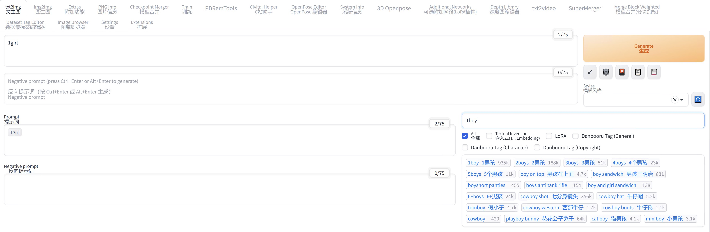
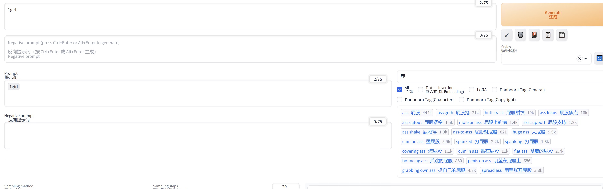

英語 |[中文](README.zh-CN.md)｜[日本語](README.ja.md)

Better Prompt は、[安定した拡散ウェブ
UI](https://github.com/AUTOMATIC1111/stable-diffusion-webui)それは追加します
プロンプト入力と編集を支援する UI。

<figure>

</figure>

# 概要

Better Prompt は、さまざまな不都合を軽減するために作成されました。
従来のプロンプト入力と編集。テキストを設定できます
追加ネットワーク (🎴) を表示せずに反転および LoRA を再配置します。
ドラッグ アンド ドロップでプロンプトの順序を変更したり、強調レベルを調整したりできます。
GUI を介してプロンプトを表示します。

# インストール

## ブラウザからのインストール（推奨）

拡張機能の「URL からインストール」オプションからインストールできます。
タブ。単純に入力してください[ｈっｔｐｓ：／／ぎてゅｂ。こｍ／←おんｇぺい／ｓｄーうぇぶいーべってｒーｐろｍｐｔ。ぎｔ](https://github.com/zhongpei/sd-webui-better-prompt.git)「URL」にある
拡張機能の git リポジトリ」フィールドを選択し、「インストール」ボタンを押します。

<figure>

</figure>

## Gitを使用したインストール

次のコマンドを実行してインストールすることもできます。
Stable Diffusion Web UI がインストールされているディレクトリ。

    git clone https://github.com/zhongpei/sd-webui-better-prompt.git extensions/sd-webui-better-prompt

## Better Prompt が表示されない、または表示が壊れている

上記の方法でインストールすると、最新バージョンになります。
インストールされています。ただし、お使いの Web UI のバージョンによってはうまく動作しない可能性があります。
使っている。 Better Prompt が正しく表示されない場合は、以下の可能性があります。
別のバージョンを使用することで問題を解決できる可能性があります。

Better Prompt のバージョンは、\[設定] タブから変更できます。ために
詳細については、を参照してください。[「バージョン＿変化」](#version_change)。

# 中国のサポート

# 使用法

Better Promptは、以下の画像の赤線で囲った部分を追加します。
ここからは、この追加コンテンツの使い方を説明していきます。

<figure>

</figure>

## 即時追加フォーム

プロンプトの追加は、次の 3 つの要素を使用して行われます。
画像。

<figure>

</figure>

### 「１」プロンプト入力フィールド

このフィールドにプロンプ​​トを入力し、Enter キーを押してコンテンツを追加します
肯定的なプロンプトに。または、Shift キーを押しながら
Enter キーを押して、否定プロンプトに内容を追加します。あれば
入力コンテンツに類似した Textual Inversion、LoRA、または Danbooru タグ、
リストに表示されます[「提案」](#suggest)。

Fuse.js は類似性の判定に使用され、さまざまなことが可能になります。
「完全一致」「接頭辞/接尾辞」などの判定方法
「AND/OR/NOT」を使用します。詳細については、を参照してください。[ヒューズjs.io
ドキュメンテーション](https://fusejs.io/examples.html#extended-search)。

Tab キーを押して、フォーカスを要素に移動します。[「提案」](#suggest)をクリックし、Esc キーを押してフォーカスを戻します。
選択した要素は、次の方法でポジティブ (ネガティブ) プロンプトに追加できます。
Enter (または Shift + Enter) を押します。

### 「２」フィルタを提案する

これらのフィルターにチェックが入っている要素のみが表示されます。[「提案」](#suggest)。

### 「３」エリアを提案する

入力した内容に類似した要素を最大 20 個リスト表示します。[「入力フィールド」](#input-field)。追加される項目の一例は、
次の図に示されています。

<figure>

</figure>

緑はTextual Inversion、青はLoRA、最後はDanbooruタグです。
これらの要素をクリック (または Shift キーを押しながらクリック) すると、要素を追加できます。
ポジティブ（ネガティブ）プロンプト。

LoRAはネガティブプロンプトには追加できないので注意してください。

Textualの要素を右クリックするとサムネイルが確認できます。
インバージョンとLoRA。

## プロンプト編集

プロンプト編集は、次の 2 つの要素を使用して行われます。
画像。

<figure>

</figure>

### 「１」ポジティブプロンプト

次を使用して追加されたプロンプト[「入力フォーム」](#input-form)この中に表示されます
エリア。この要素は、肯定的なプロンプト入力領域と同期されます。
Web UIの。

各プロンプトはドラッグ アンド ドロップで並べ替えたり、削除したりできます。
Shiftキーを押しながらクリックします。

LoRA と通常のプロンプトを右クリックすると、調整用のポップアップが表示されます
強調レベル。

### 「２」否定的なプロンプト

LoRAを追加できない以外は同じです[「ポジティブプロンプト」](#positive-prompt)。

# 構成

Better Prompt は、\[設定] タブに独自の構成セクションを作成します。
ここでは各項目について説明していきます。

<figure>

</figure>

## より良いプロンプトのバージョン

Better Prompt のバージョンを変更できます。デフォルト値は空白です
(インストール時の最新バージョン)。を変更すると、
設定を変更するには、Web UIを再起動する必要があります。 (リロードだけではありません)

Better Prompt の現在のバージョンがコンソールに表示されます。
ウェブUI。対応する Web UI バージョンについては、以下の表を参照してください。
それぞれのバージョンに。

<table>
<colgroup>
<col style="width: 33%" />
<col style="width: 33%" />
<col style="width: 33%" />
</colgroup>
<tbody>
<tr class="odd">
<td style="text-align: left;">
Version
</td>
<td style="text-align: left;">
Web UI Version (Minimum)
</td>
<td style="text-align: left;">
Web UI Version (Maximum)
</td>
</tr>
<tr class="even">
<td style="text-align: left;">
0.1.0
</td>
<td style="text-align: left;">
9e1afa9e (2023-03-25)
</td>
<td style="text-align: left;">
~
</td>
</tr>
</tbody>
</table>

## 更新通知を表示する

チェックすると、アップデートが利用可能になったときに通知が表示されます。

## 更新をバージョンごとに 1 回だけ通知する

チェックすると、アップデートがあったときにバージョンごとに 1 回だけ通知します。
利用可能。

## 更新通知を表示する間隔

更新通知を表示する間隔を指定します。単位は
「日」。デフォルト値は 1 日です。

## より良いプロンプトの言語

Better Prompt で使用する言語を指定します。デフォルト値は空白です
（英語）。現在、ja＿JP言語も利用可能です。を変更すると、
設定を変更するには、Web UI を再読み込みする必要があります。

# やることリスト

-   「」プロンプトのエイリアスを設定する機能を追加

-   「」プロンプトマージ機能に追加

-   「」最後に追加したプロンプトを元に戻すことを許可します。「Ctrl + Z」

-   「」より良いスタイルのサポート

-   「」LoRA ブロック重みのサポート

-   「」他の追加ネットワークをサポート

-   「」ネストされたプロンプトのサポート

-   「」サポートスケジュールの表記 (例:「赤:緑:0.5」）

# ライセンス

Better Prompt は MIT ライセンスに基づいて開発および公開されています。ために
ライセンスの詳細については、以下のリンクを参照してください。

[MIT License](./LICENSE)
